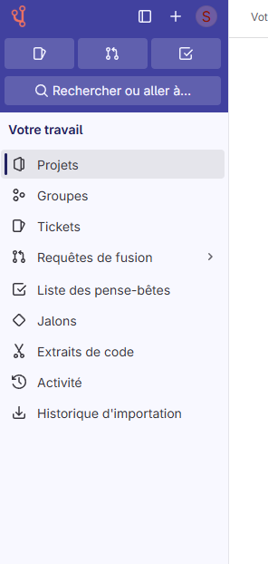
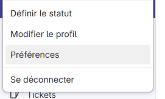
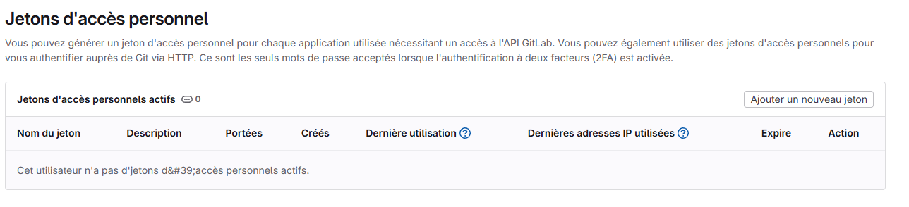
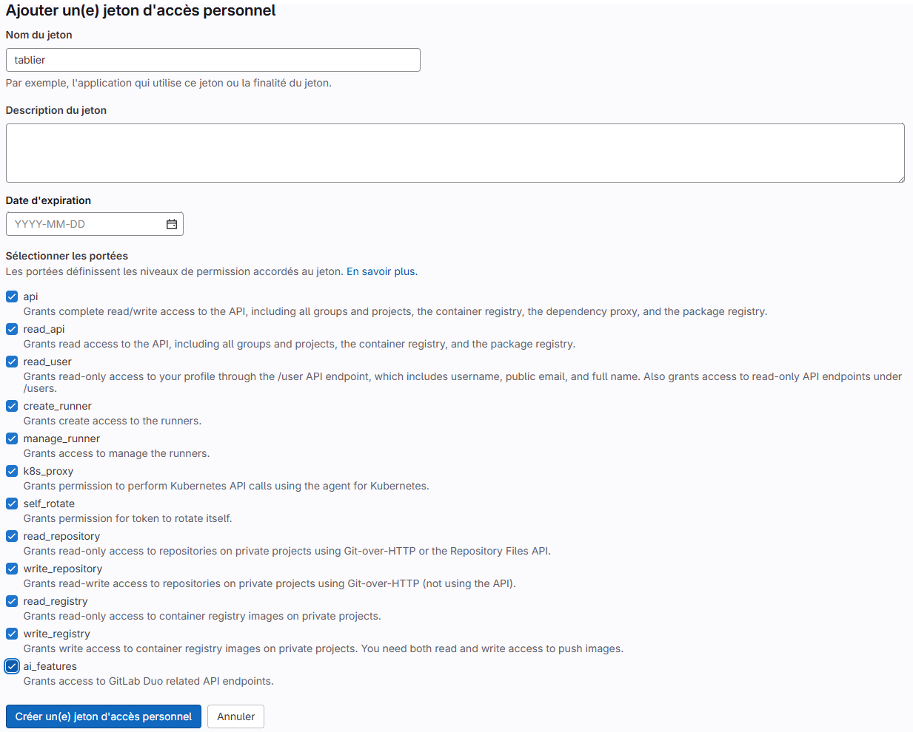

# Documentation de l'API de L'Établi

Cette documentation décrit comment utiliser l'API de la forge de l'éducation avec un token d'accès personnel pour intégrer les fonctionnalités de L'Établi dans d'autres projets.

## Obtention d'un Token d'Accès

Avant de pouvoir utiliser l'API, vous devez obtenir un token d'accès personnel. Suivez ces étapes :

1. **Accéder à votre profil** - Cliquez sur votre avatar en haut à droite, puis sélectionnez "Préférences"
   

2. **Accéder aux préférences** - Dans le menu latéral, naviguez vers les paramètres de votre compte
   

3. **Créer un jeton d'accès** - Recherchez la section "Jetons d'accès" ou "Access Tokens"
   

4. **Ajouter un nouveau jeton** - Cliquez sur le bouton pour ajouter un nouveau jeton, donnez-lui un nom et sélectionnez les permissions appropriées (au minimum : api, read_repository, write_repository)
   

5. **Copier le jeton** - Une fois créé, copiez immédiatement le jeton généré car il ne sera plus visible après avoir quitté la page

## Authentification avec le Token

Pour authentifier vos requêtes API, vous devez inclure le token dans l'en-tête HTTP `Authorization` :

```
Authorization: Bearer VOTRE_TOKEN
```

## URL de Base de l'API

L'URL de base pour toutes les requêtes API est :

```
https://forge.apps.education.fr/api/v4
```

## Endpoints API

### Projets (Dépôts)

#### Lister tous les dépôts

```
GET /projects?membership=true&simple=true
```

**Exemple de requête :**

```python
import requests

token = "VOTRE_TOKEN"
headers = {"Authorization": f"Bearer {token}"}

response = requests.get(
    "https://forge.apps.education.fr/api/v4/projects?membership=true&simple=true",
    headers=headers
)

if response.status_code == 200:
    repos = response.json()
    for repo in repos:
        print(f"ID: {repo['id']}, Nom: {repo['name']}")
```

#### Créer un nouveau dépôt

```
POST /projects
```

**Corps de la requête :**

```json
{
    "name": "nom-du-depot",
    "description": "Description du dépôt",
    "visibility": "private"  // ou "public"
}
```

**Exemple de requête :**

```python
import requests

token = "VOTRE_TOKEN"
headers = {
    "Authorization": f"Bearer {token}",
    "Content-Type": "application/json"
}

data = {
    "name": "mon-nouveau-depot",
    "description": "Un nouveau dépôt créé via l'API",
    "visibility": "private"
}

response = requests.post(
    "https://forge.apps.education.fr/api/v4/projects",
    headers=headers,
    json=data
)

if response.status_code == 201:
    new_repo = response.json()
    print(f"Dépôt créé avec l'ID: {new_repo['id']}")
```

#### Obtenir les détails d'un dépôt

```
GET /projects/{project_id}
```

**Exemple de requête :**

```python
import requests

token = "VOTRE_TOKEN"
headers = {"Authorization": f"Bearer {token}"}
project_id = 123  # Remplacer par l'ID réel du projet

response = requests.get(
    f"https://forge.apps.education.fr/api/v4/projects/{project_id}",
    headers=headers
)

if response.status_code == 200:
    repo = response.json()
    print(f"Nom: {repo['name']}, Description: {repo['description']}")
```

#### Mettre à jour un dépôt

```
PUT /projects/{project_id}
```

**Corps de la requête :**

```json
{
    "description": "Nouvelle description",
    "visibility": "public"
}
```

**Exemple de requête :**

```python
import requests

token = "VOTRE_TOKEN"
headers = {
    "Authorization": f"Bearer {token}",
    "Content-Type": "application/json"
}
project_id = 123  # Remplacer par l'ID réel du projet

data = {
    "description": "Nouvelle description mise à jour via l'API",
    "visibility": "public"
}

response = requests.put(
    f"https://forge.apps.education.fr/api/v4/projects/{project_id}",
    headers=headers,
    json=data
)

if response.status_code == 200:
    updated_repo = response.json()
    print(f"Dépôt mis à jour: {updated_repo['name']}")
```

#### Supprimer un dépôt

```
DELETE /projects/{project_id}
```

**Exemple de requête :**

```python
import requests

token = "VOTRE_TOKEN"
headers = {"Authorization": f"Bearer {token}"}
project_id = 123  # Remplacer par l'ID réel du projet

response = requests.delete(
    f"https://forge.apps.education.fr/api/v4/projects/{project_id}",
    headers=headers
)

if response.status_code == 202:
    print(f"Dépôt {project_id} supprimé avec succès")
```

### Fichiers et Commits

#### Lister les fichiers d'un dépôt

```
GET /projects/{project_id}/repository/tree?recursive=true
```

**Exemple de requête :**

```python
import requests

token = "VOTRE_TOKEN"
headers = {"Authorization": f"Bearer {token}"}
project_id = 123  # Remplacer par l'ID réel du projet

response = requests.get(
    f"https://forge.apps.education.fr/api/v4/projects/{project_id}/repository/tree?recursive=true",
    headers=headers
)

if response.status_code == 200:
    files = response.json()
    for file in files:
        if file['type'] == 'blob':  # Uniquement les fichiers, pas les répertoires
            print(f"Fichier: {file['path']}")
```

#### Obtenir le contenu d'un fichier

```
GET /projects/{project_id}/repository/files/{file_path}?ref=master
```

**Note :** Le chemin du fichier doit être encodé en URL (remplacer / par %2F)

**Exemple de requête :**

```python
import requests

token = "VOTRE_TOKEN"
headers = {"Authorization": f"Bearer {token}"}
project_id = 123  # Remplacer par l'ID réel du projet
file_path = "index.html"  # Chemin du fichier

# Encoder le chemin du fichier
encoded_file_path = file_path.replace('/', '%2F')

response = requests.get(
    f"https://forge.apps.education.fr/api/v4/projects/{project_id}/repository/files/{encoded_file_path}?ref=master",
    headers=headers
)

if response.status_code == 200:
    file_info = response.json()
    import base64
    content = base64.b64decode(file_info['content']).decode('utf-8')
    print(f"Contenu du fichier {file_path}:\n{content}")
```

#### Créer ou mettre à jour un fichier (commit)

```
POST /projects/{project_id}/repository/commits
```

**Corps de la requête :**

```json
{
    "branch": "master",
    "commit_message": "Message du commit",
    "actions": [
        {
            "action": "create",  // ou "update" ou "delete"
            "file_path": "chemin/du/fichier.html",
            "content": "Contenu du fichier"
        }
    ]
}
```

**Exemple de requête :**

```python
import requests

token = "VOTRE_TOKEN"
headers = {
    "Authorization": f"Bearer {token}",
    "Content-Type": "application/json"
}
project_id = 123  # Remplacer par l'ID réel du projet

data = {
    "branch": "master",
    "commit_message": "Ajout d'un nouveau fichier via l'API",
    "actions": [
        {
            "action": "create",
            "file_path": "nouveau-fichier.html",
            "content": "<html><body><h1>Nouveau fichier créé via l'API</h1></body></html>"
        }
    ]
}

response = requests.post(
    f"https://forge.apps.education.fr/api/v4/projects/{project_id}/repository/commits",
    headers=headers,
    json=data
)

if response.status_code == 201:
    commit = response.json()
    print(f"Commit créé: {commit['id']}")
```

### Pipelines

#### Lister les pipelines d'un dépôt

```
GET /projects/{project_id}/pipelines
```

**Exemple de requête :**

```python
import requests

token = "VOTRE_TOKEN"
headers = {"Authorization": f"Bearer {token}"}
project_id = 123  # Remplacer par l'ID réel du projet

response = requests.get(
    f"https://forge.apps.education.fr/api/v4/projects/{project_id}/pipelines",
    headers=headers
)

if response.status_code == 200:
    pipelines = response.json()
    for pipeline in pipelines:
        print(f"Pipeline ID: {pipeline['id']}, Status: {pipeline['status']}")
```

#### Déclencher un pipeline

```
POST /projects/{project_id}/pipeline
```

**Corps de la requête :**

```json
{
    "ref": "master"  // ou "main" selon la branche par défaut
}
```

**Exemple de requête :**

```python
import requests

token = "VOTRE_TOKEN"
headers = {
    "Authorization": f"Bearer {token}",
    "Content-Type": "application/json"
}
project_id = 123  # Remplacer par l'ID réel du projet

data = {
    "ref": "master"
}

response = requests.post(
    f"https://forge.apps.education.fr/api/v4/projects/{project_id}/pipeline",
    headers=headers,
    json=data
)

if response.status_code == 201:
    pipeline = response.json()
    print(f"Pipeline déclenché: {pipeline['id']}")
```

#### Obtenir le statut d'un pipeline

```
GET /projects/{project_id}/pipelines/{pipeline_id}
```

**Exemple de requête :**

```python
import requests

token = "VOTRE_TOKEN"
headers = {"Authorization": f"Bearer {token}"}
project_id = 123  # Remplacer par l'ID réel du projet
pipeline_id = 456  # Remplacer par l'ID réel du pipeline

response = requests.get(
    f"https://forge.apps.education.fr/api/v4/projects/{project_id}/pipelines/{pipeline_id}",
    headers=headers
)

if response.status_code == 200:
    pipeline = response.json()
    print(f"Status du pipeline: {pipeline['status']}")
```

### Pages

#### Obtenir l'URL des pages d'un dépôt

```
GET /projects/{project_id}/pages
```

**Exemple de requête :**

```python
import requests

token = "VOTRE_TOKEN"
headers = {"Authorization": f"Bearer {token}"}
project_id = 123  # Remplacer par l'ID réel du projet

response = requests.get(
    f"https://forge.apps.education.fr/api/v4/projects/{project_id}/pages",
    headers=headers
)

if response.status_code == 200:
    pages_info = response.json()
    print(f"URL des pages: {pages_info['url']}")
```

## Exemple d'Intégration Complète

Voici un exemple complet d'intégration qui montre comment créer un nouveau dépôt, ajouter un fichier HTML, déclencher un pipeline et obtenir l'URL des pages :

```python
import requests
import time

# Configuration
token = "VOTRE_TOKEN"
headers = {
    "Authorization": f"Bearer {token}",
    "Content-Type": "application/json"
}
base_url = "https://forge.apps.education.fr/api/v4"

# 1. Créer un nouveau dépôt
repo_data = {
    "name": "site-demo-api",
    "description": "Site web créé via l'API",
    "visibility": "public"
}

create_repo_response = requests.post(
    f"{base_url}/projects",
    headers=headers,
    json=repo_data
)

if create_repo_response.status_code != 201:
    print(f"Erreur lors de la création du dépôt: {create_repo_response.text}")
    exit(1)

repo = create_repo_response.json()
project_id = repo['id']
print(f"Dépôt créé avec l'ID: {project_id}")

# 2. Ajouter un fichier index.html
html_content = """
<!DOCTYPE html>
<html>
<head>
    <title>Site Demo API</title>
    <meta charset="UTF-8">
    <meta name="viewport" content="width=device-width, initial-scale=1.0">
    <style>
        body { font-family: Arial, sans-serif; margin: 0; padding: 20px; }
        .container { max-width: 800px; margin: 0 auto; }
        h1 { color: #333; }
    </style>
</head>
<body>
    <div class="container">
        <h1>Site Demo API</h1>
        <p>Ce site a été créé automatiquement via l'API de la forge de l'éducation.</p>
    </div>
</body>
</html>
"""

commit_data = {
    "branch": "master",
    "commit_message": "Ajout du fichier index.html",
    "actions": [
        {
            "action": "create",
            "file_path": "index.html",
            "content": html_content
        }
    ]
}

commit_response = requests.post(
    f"{base_url}/projects/{project_id}/repository/commits",
    headers=headers,
    json=commit_data
)

if commit_response.status_code != 201:
    print(f"Erreur lors de la création du fichier: {commit_response.text}")
    exit(1)

print("Fichier index.html créé avec succès")

# 3. Ajouter un fichier .gitlab-ci.yml pour activer les pages
ci_content = """pages:
  stage: deploy
  script:
    - mkdir .public
    - cp -r * .public
    - mv .public public
  artifacts:
    paths:
      - public
  only:
    - master
"""

ci_commit_data = {
    "branch": "master",
    "commit_message": "Ajout du fichier .gitlab-ci.yml pour activer les pages",
    "actions": [
        {
            "action": "create",
            "file_path": ".gitlab-ci.yml",
            "content": ci_content
        }
    ]
}

ci_commit_response = requests.post(
    f"{base_url}/projects/{project_id}/repository/commits",
    headers=headers,
    json=ci_commit_data
)

if ci_commit_response.status_code != 201:
    print(f"Erreur lors de la création du fichier CI: {ci_commit_response.text}")
    exit(1)

print("Fichier .gitlab-ci.yml créé avec succès")

# 4. Déclencher un pipeline
pipeline_data = {
    "ref": "master"
}

pipeline_response = requests.post(
    f"{base_url}/projects/{project_id}/pipeline",
    headers=headers,
    json=pipeline_data
)

if pipeline_response.status_code != 201:
    print(f"Erreur lors du déclenchement du pipeline: {pipeline_response.text}")
    exit(1)

pipeline = pipeline_response.json()
pipeline_id = pipeline['id']
print(f"Pipeline déclenché avec l'ID: {pipeline_id}")

# 5. Attendre que le pipeline soit terminé
max_attempts = 10
attempt = 0
pipeline_status = "pending"

while pipeline_status in ["pending", "running"] and attempt < max_attempts:
    time.sleep(5)  # Attendre 5 secondes entre chaque vérification
    attempt += 1
    
    pipeline_status_response = requests.get(
        f"{base_url}/projects/{project_id}/pipelines/{pipeline_id}",
        headers=headers
    )
    
    if pipeline_status_response.status_code != 200:
        print(f"Erreur lors de la vérification du statut du pipeline: {pipeline_status_response.text}")
        break
    
    pipeline_info = pipeline_status_response.json()
    pipeline_status = pipeline_info['status']
    print(f"Statut du pipeline: {pipeline_status} (tentative {attempt}/{max_attempts})")

# 6. Obtenir l'URL des pages
if pipeline_status == "success":
    # Attendre un peu que les pages soient disponibles
    time.sleep(10)
    
    pages_response = requests.get(
        f"{base_url}/projects/{project_id}/pages",
        headers=headers
    )
    
    if pages_response.status_code == 200:
        pages_info = pages_response.json()
        pages_url = pages_info.get('url', '')
        print(f"Site déployé avec succès! URL des pages: {pages_url}")
    else:
        print("Les pages ne sont pas encore disponibles ou une erreur s'est produite")
else:
    print(f"Le pipeline n'a pas réussi. Statut final: {pipeline_status}")
```

## Conseils et Bonnes Pratiques

1. **Sécurité du Token** : Ne partagez jamais votre token d'accès personnel. Traitez-le comme un mot de passe.

2. **Gestion des Erreurs** : Implémentez toujours une gestion des erreurs robuste dans vos scripts d'intégration.

3. **Limitation de Débit** : L'API peut avoir des limites de débit. Évitez de faire trop de requêtes en peu de temps.

4. **Permissions** : Assurez-vous que votre token a les permissions nécessaires pour les opérations que vous souhaitez effectuer.

5. **Environnements** : Utilisez des variables d'environnement pour stocker votre token plutôt que de le coder en dur dans vos scripts.

## Ressources Supplémentaires

- [Documentation officielle de l'API GitLab](https://docs.gitlab.com/ee/api/) (La forge de l'éducation est basée sur GitLab)
- [Tutoriels vidéo sur l'utilisation de L'Établi](https://etabligit.onrender.com/)
