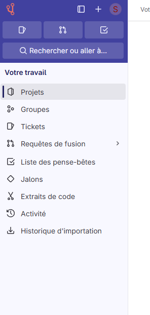
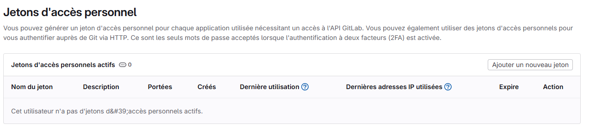

# L'Établi - Application Pédagogique pour la Forge de l'Éducation

[](https://etabligit.onrender.com/)

L'Établi est une application pédagogique pour la gestion de dépôts sur la forge de l'éducation. Elle permet aux utilisateurs de créer, gérer et collaborer sur des projets, d'éditer des fichiers directement dans l'interface, et de déployer des sites web via les pages de la forge.

**Démo en ligne :** [https://etabligit.onrender.com/](https://etabligit.onrender.com/)

> **Note :** Pour le moment, L'Établi se concentre sur l'assistance à la création d'un simple site web. Dans les prochaines versions, grâce à l'intégration avancée de l'IA, l'application pourra faire bien plus, comme suggérer des améliorations de code, générer du contenu, et offrir une assistance personnalisée au développement.

## Fonctionnalités

- **Gestion de dépôts** : Créez et gérez facilement vos dépôts sur la forge de l'éducation
- **Édition en ligne** : Modifiez vos fichiers directement dans l'interface web
- **Déploiement simplifié** : Déployez vos sites web via les pages de la forge en quelques clics
- **Collaboration** : Travaillez en équipe sur des projets partagés
- **Interface intuitive** : Une interface utilisateur moderne et facile à utiliser
- **Outils IA intégrés** : Accès à une sélection d'outils d'IA pour le développement

## Technologies

- **Backend** :
  - Python
  - FastAPI (API)
  - Flask (UI)
  - Docker pour le déploiement

- **Frontend** :
  - HTML/CSS/JavaScript
  - Bootstrap pour l'interface utilisateur
  - Intégration avec l'API de la forge de l'éducation

## Installation

Assurez-vous d'avoir installé toutes les dépendances requises :

```bash
pip install -r requirements.txt
```

## Utilisation

### Lanceur Unifié

Le lanceur permet de démarrer les services API (FastAPI) et UI (Flask) de L'Établi à partir d'un seul point d'entrée.

#### Lancer les deux services (API et UI)

```bash
python launcher.py
```

Cette commande démarre l'API sur le port 8000 et l'UI sur le port 5000.

#### Lancer uniquement l'API

```bash
python launcher.py --api-only
```

#### Lancer uniquement l'UI

```bash
python launcher.py --ui-only
```

#### Options de configuration

```bash
python launcher.py --help
```

Affiche toutes les options disponibles :
- `--api-only` : Démarre uniquement le service API
- `--ui-only` : Démarre uniquement le service UI
- `--api-host` : Spécifie l'hôte pour l'API
- `--api-port` : Spécifie le port pour l'API
- `--ui-host` : Spécifie l'hôte pour l'UI
- `--ui-port` : Spécifie le port pour l'UI
- `--no-debug` : Désactive le mode debug de Flask

### Version Production

Pour lancer en mode production sur les ports 8099 (API) et 5099 (UI) :

```bash
python launcher_prod.py
```

### Docker

#### Développement

```bash
docker-compose -f docker-compose.unified.yml up unified
```

#### Production

```bash
docker-compose -f docker-compose.prod.yml up etabli
```

## Structure du Projet

- `api/` - Code source de l'API FastAPI
- `templates/` - Templates HTML pour l'interface utilisateur Flask
- `medias/` - Ressources médias utilisées dans l'application
- `launcher.py` - Script de lancement pour l'environnement de développement
- `launcher_prod.py` - Script de lancement pour l'environnement de production
- `docker-compose.yml` - Configuration Docker pour le développement
- `docker-compose.prod.yml` - Configuration Docker pour la production
- `API.md` - Documentation complète de l'API pour l'intégration avec d'autres projets

## Documentation de l'API

L'Établi expose une API complète qui permet d'intégrer ses fonctionnalités dans d'autres projets. Vous pouvez utiliser cette API pour :

- Créer et gérer des dépôts
- Ajouter, modifier et supprimer des fichiers
- Déclencher des pipelines
- Obtenir le statut des pipelines
- Accéder aux URLs des pages déployées

Pour une documentation détaillée de l'API, consultez le fichier [API.md](API.md).

## Contribution

Les contributions à ce projet sont les bienvenues. Veuillez suivre ces étapes pour contribuer :

1. Forkez le projet
2. Créez votre branche de fonctionnalité (`git checkout -b feature/amazing-feature`)
3. Committez vos changements (`git commit -m 'Add some amazing feature'`)
4. Poussez vers la branche (`git push origin feature/amazing-feature`)
5. Ouvrez une Pull Request

## Auteur

- **Steeve Pytel**

## Licence

Ce projet est sous licence MIT. Voir le fichier `LICENSE` pour plus de détails.

## Roadmap

- **Version actuelle :** Assistance à la création de sites web simples
- **Prochaines versions :**
  - Intégration avancée d'outils d'IA pour l'assistance au développement
  - Suggestions automatiques d'amélioration de code
  - Génération de contenu assistée par IA
  - Assistance personnalisée basée sur les habitudes de développement
  - Support pour des projets plus complexes (applications web dynamiques, etc.)

## Création d'un Token de Déploiement

Pour utiliser L'Établi avec la forge de l'éducation, vous devez créer un token d'accès personnel. Voici les étapes à suivre :

1. **Accéder à votre profil** - Cliquez sur votre avatar en haut à droite, puis sélectionnez "Préférences"
   

2. **Accéder aux préférences** - Dans le menu latéral, naviguez vers les paramètres de votre compte
   

3. **Créer un jeton d'accès** - Recherchez la section "Jetons d'accès" ou "Access Tokens"
   

4. **Ajouter un nouveau jeton** - Cliquez sur le bouton pour ajouter un nouveau jeton, donnez-lui un nom et sélectionnez les permissions appropriées (au minimum : api, read_repository, write_repository)
   

5. **Copier le jeton** - Une fois créé, copiez immédiatement le jeton généré car il ne sera plus visible après avoir quitté la page

6. **Utiliser le jeton dans L'Établi** - Collez ce jeton dans L'Établi lorsqu'il vous sera demandé lors de la connexion

## Contact

Pour toute question ou suggestion concernant ce projet, n'hésitez pas à ouvrir une issue sur le dépôt de la forge de l'éducation.
